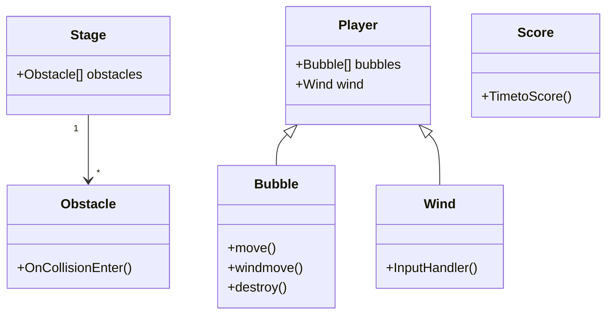

```mermaid
classDiagram
    Stage "1" --> "*" Obstacle
    Player <|--Bubble
    Player <|--Wind
    class Player{
        +Bubble[] bubbles
        +Wind wind
    }
    class Bubble{
        +move()
        +windmove()
        +destroy()
    }
    class Obstacle{
        +OnCollisionEnter()
    }
    class Stage{
        +Obstacle[] obstacles

    }
    class Score{

        +TimetoScore()
    }
    class Wind{
        +InputHandler()
    }
```